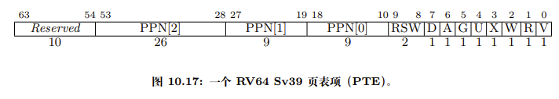

# ch4报告 -- c2h4moe
## 做了什么
本次实验实现了分页机制，开发了两个个新的系统调用供用户态程序能够管理自己的地址空间`sys_mmap(_start: usize, _len: usize, _port: usize)`和`sys_munmap(_start: usize, _len: usize)`，同时由于分页机制开启，之前的sys_get_time和sys_task_info失效，对它们进行了重写。由于mmap和munmap需要对用户的地址空间做检查，我也在memoryset模块增加了方法。

## 问答题

1. 
V代表该表项是否有效，RWX代表权限控制，U位代表是否是用户页，U=0代表只有S态可访问，U=1代表只有用户态可访问。G代表该页是否存在于所有地址空间，A位代表该页是否被访问过，D位代表该页是否被写入过，PPN是物理页号。
2. 1. 有指令页异常（12），存数页异常（15）和读数页异常（13）。
   2. 发生缺页时，scause存储异常信息，sepc存储导致异常的指令的地址。
   3. 可以节省内存空间，因为可能在运行时并不会用到所有的地址空间，这样按需导入，可以更加灵活的管理内存。
   4. 一个一级页表项可以管理1G空间，所以需要$10\times 512 \times 4K + 10\times 4K + 4K$ 约为 20M
   5. 在发生缺页异常时查找地址空间，若缺少的页面存在于地址空间中，那么就分配物理空间，同时标记页表项有效。
   6. 页表项V=0。
3. 1. 将所有用户态程序地址空间的一部分留出来映射到内核的全部，在切换程序时才切换页表，切换时将satp改为另一个程序的页表基址即可。
   1. 在内核页面的页表项设置U=0，只有内核可以访问。
   1. 不用每次syscall进入内核态都要更换页表，刷新TLB，导致之后一段时间TLB miss率大幅提高，而是只有当切换程序时才需要更换页表，得到了性能的提升。
   1. 双页表下一旦进入到内核态，便要立即更换页表，而单页表模式在一般的syscall时无需更换，当多道程序分时运行需要切换进程时，才要切换页表。

## 荣誉准则
1. 在完成本次实验的过程（含此前学习的过程）中，我未与他人就（与本次实验相关的）方面做过交流。

2. 此外，我也参考了 以下资料 ，还在代码中对应的位置以注释形式记录了具体的参考来源及内容：
《RISC-V-Reader》

3. 我独立完成了本次实验除以上方面之外的所有工作，包括代码与文档。 我清楚地知道，从以上方面获得的信息在一定程度上降低了实验难度，可能会影响起评分。

4. 我从未使用过他人的代码，不管是原封不动地复制，还是经过了某些等价转换。 我未曾也不会向他人（含此后各届同学）复制或公开我的实验代码，我有义务妥善保管好它们。 我提交至本实验的评测系统的代码，均无意于破坏或妨碍任何计算机系统的正常运转。 我清楚地知道，以上情况均为本课程纪律所禁止，若违反，对应的实验成绩将按“-100”分计。